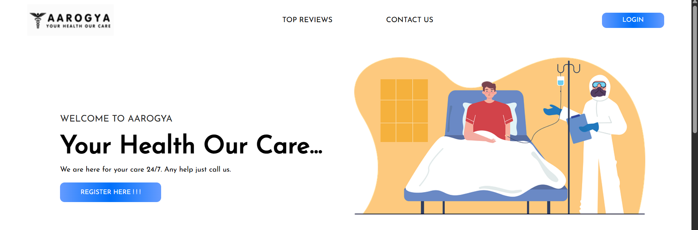

# AAROGYA-FRONT-END-MEDICAL-WEBSITE

Project Overview: 

The purpose of this academic project is to develop a static website for "Aarogya," a popular medical company that specializes in providing various services like the location services, first aid instruction services and the medical drug information service to the users. The website will showcase the company's services, top reviews, and contact information. The website will be built using HTML, CSS, to ensure a responsive and visually appealing user interface.

Project Glimpses: 

Project Goals:

1.	Develop a static website for Aarogya to establish an online presence and showcase their expertise services offered by the Aarogya Team to the end users.
2.	Highlight the company's services and demonstrate their top reviews from famous personalities around the world.
3.	Create a visually appealing and intuitive user interface that aligns with the company's brand and philosophy.
4.	Implement responsive design principles to ensure easy and optimized usage of the website by the end users.
Project Resources: The following resources will be required for the successful completion of the project:
1.	Development tools (code editor, version control system).
2.	Visual studio 
3.	Images and graphics for the website's design.
4.	Hosting and domain for website deployment (optional for academic purposes).

Project Resources: 

The following resources will be required for the successful completion of the project:
1.	Development tools (code editor, version control system).
2.	Visual studio 
3.	Images and graphics for the website's design.
4.	Hosting and domain for website deployment (optional for academic purposes).

Project Deliverables:

1.	Complete static website codebase with HTML, CSS and image files.
2.	Project documentation, including design decisions and challenges faced.
3.	Presentation showcasing the website's features and development process.

Project Conclusion: 

By completing this academic project, the team aims to showcase their skills in web development, HTML and CSS. The website developed for Aarogya will serve as an impressive portfolio piece and demonstrate their ability to create visually appealing and user-centric static websites for businesses in the real world.
